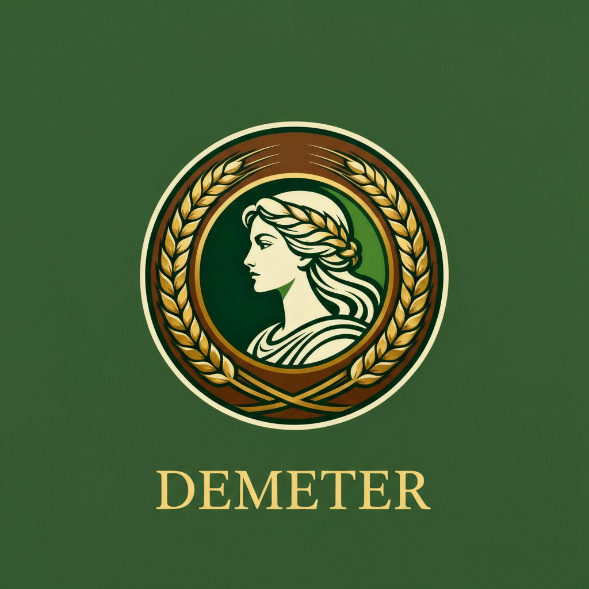

  # Demeter 🌾

  API para análise e classificação de grãos através de processamento de imagens usando Machine Learning.
</div>

## 📋 Sobre

Demeter é uma aplicação que permite o processamento automático de imagens de grãos, oferecendo análise de qualidade, contagem, detecção de defeitos e classificação através de algoritmos de Machine Learning.

## ✨ Funcionalidades

- **Análise de Qualidade**: Classificação automática em categorias A, B, C ou D
- **Detecção de Defeitos**: Identificação de grãos ardidos, mofados, carunchados e imaturos
- **Contagem Automática**: Contabilização de grãos totais, íntegros, quebrados e defeituosos
- **Processamento em Lote**: Análise de múltiplas imagens simultaneamente
- **Histórico**: Consulta de análises anteriores com filtros e paginação
- **Relatórios**: Geração de estatísticas e exportação em PDF/CSV

## 🔧 Tecnologias

- Machine Learning
- Autenticação JWT
- Processamento de imagens
- API REST

## 📚 Documentação da API

A documentação completa da API está disponível no SwaggerHub:

**[Documentação Demeter API v1.0.0](https://app.swaggerhub.com/apis/unibalsas-100/Demeter/1.0.0)**

## 🚀 Endpoints Principais

- `POST /auth/register` - Registro de usuário
- `POST /auth/login` - Autenticação
- `POST /processamento/analisar` - Análise de imagem individual
- `POST /processamento/lote` - Análise de múltiplas imagens
- `GET /historico` - Histórico de análises
- `GET /relatorios/estatisticas` - Estatísticas consolidadas
- `POST /relatorios/exportar` - Exportação de relatórios

## 📊 Tipos de Grãos Suportados

- Soja

## 🔐 Autenticação

A API utiliza JWT (JSON Web Token). Inclua o token no header de todas as requisições protegidas:

```
Authorization: Bearer {seu-token}
```

## 📈 Análise Fornecida

Cada análise retorna:
- Tipo de grão identificado
- Classificação de qualidade (A-D)
- Contagem total e por categoria
- Defeitos detectados
- Umidade estimada
- Percentual de impurezas
- Tamanho médio dos grãos
- Nível de confiança da análise

## 📝 Formatos de Imagem Aceitos

- JPG
- JPEG
- PNG
